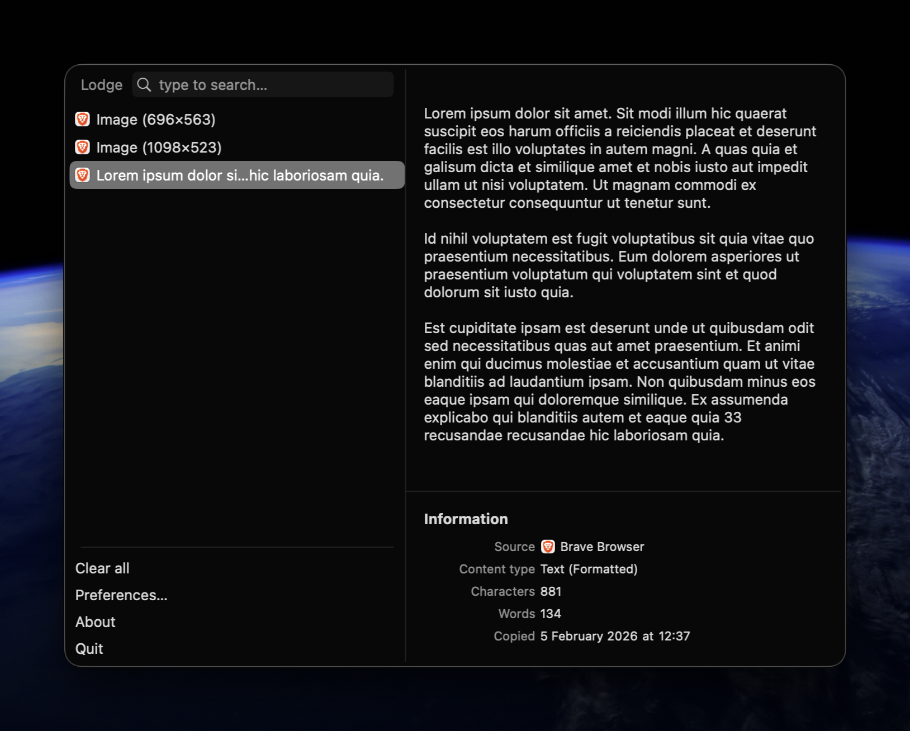
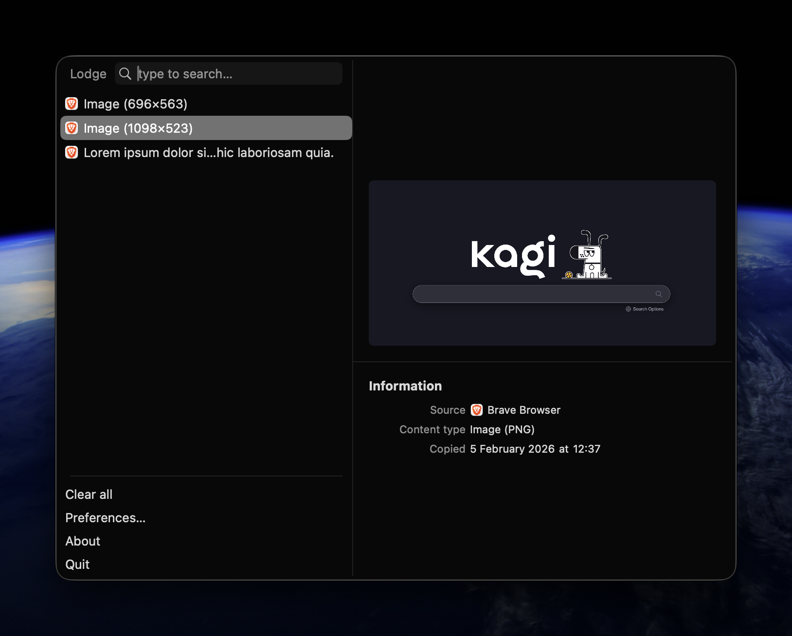
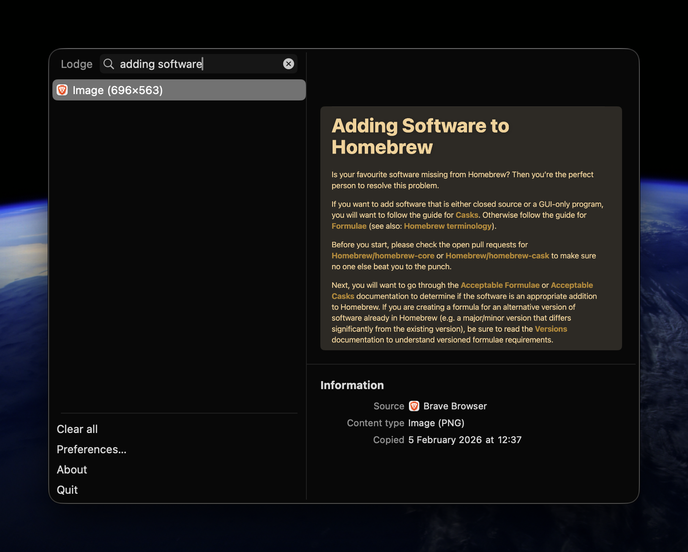

# Lodge

Lodge is a lightweight clipboard manager for macOS and a hard fork of
[Maccy](https://maccy.app) by [p0deje](https://github.com/p0deje/Maccy).
All credit for the original app belongs to the Maccy contributors.

Lodge works on macOS Sonoma 14 or higher.

| Text preview with detail panel | Image preview | OCR text search in images |
|---|---|---|
|  |  |  |
| Split view with content preview, source app, word count, and timestamps. | Full image preview with metadata. | Search finds text inside images using built-in OCR. |

<!-- vim-markdown-toc GFM -->

* [Fork Notice](#fork-notice)
* [Differences from Maccy](#differences-from-maccy)
* [Features](#features)
* [Install](#install)
* [Usage](#usage)
* [Advanced](#advanced)
  * [Ignore Copied Items](#ignore-copied-items)
  * [Ignore Custom Copy Types](#ignore-custom-copy-types)
  * [Speed up Clipboard Check Interval](#speed-up-clipboard-check-interval)
* [FAQ](#faq)
  * [Why doesn't it paste when I select an item in history?](#why-doesnt-it-paste-when-i-select-an-item-in-history)
  * [When assigning a hotkey to open Lodge, it says that this hotkey is already used in some system setting.](#when-assigning-a-hotkey-to-open-clippaid-it-says-that-this-hotkey-is-already-used-in-some-system-setting)
  * [How to restore hidden footer?](#how-to-restore-hidden-footer)
  * [How to ignore copies from Universal Clipboard?](#how-to-ignore-copies-from-universal-clipboard)
  * [My keyboard shortcut stopped working in password fields. How do I fix this?](#my-keyboard-shortcut-stopped-working-in-password-fields-how-do-i-fix-this)
* [Translations](#translations)
* [Motivation](#motivation)
* [License](#license)

<!-- vim-markdown-toc -->

## Fork Notice

Lodge is a hard fork of Maccy. This repository exists to explore independent
changes while crediting the original project. For the official releases and
upstream updates, use [Maccy](https://github.com/p0deje/Maccy).

## Differences from Maccy

* Rebranded as Lodge (name and documentation).
* New popup style: split view with a detail panel showing previews and metadata
  (source app, content type, counts, timestamps).
* Optional application icons in the history list.
* History list no longer shows the shortcut badges column.
* Performance work: cached previews, precomputed text stats, and search caching
  for large histories.
* New bundle identifier (`com.nklmilojevic.Lodge`) and Lodge Xcode scheme.

## Features

* Lightweight and fast (inherited from Maccy)
* Keyboard-first workflows
* Split view mode with detailed preview panel
* OCR text search in images
* Pinned items with quick actions
* Optional source-application icons
* Secure and private
* Native UI
* Open source and free

## Install

### Homebrew

```sh
brew install nklmilojevic/lodge/lodge
```

### Download

Download the latest release from the
[GitHub releases](https://github.com/nklmilojevic/Lodge/releases/latest) page.

### Build from source

```sh
xcodebuild -scheme Lodge -configuration Debug
```

## Distribution

For GitHub releases, notarization, and Sparkle appcast setup, see
[docs/distribution.md](docs/distribution.md).

## Usage

Usage is currently the same as Maccy, with the addition of the split view detail
panel. Keyboard shortcuts are unchanged.

1. <kbd>SHIFT (⇧)</kbd> + <kbd>COMMAND (⌘)</kbd> + <kbd>C</kbd> to popup Lodge or
   click on its icon in the menu bar.
2. Type what you want to find.
3. To select the history item you wish to copy, press <kbd>ENTER</kbd>, or click
   the item, or use <kbd>COMMAND (⌘)</kbd> + `n` shortcut.
4. To choose the history item and paste, press <kbd>OPTION (⌥)</kbd> +
   <kbd>ENTER</kbd>, or <kbd>OPTION (⌥)</kbd> + <kbd>CLICK</kbd> the item, or use
   <kbd>OPTION (⌥)</kbd> + `n` shortcut.
5. To choose the history item and paste without formatting, press
   <kbd>OPTION (⌥)</kbd> + <kbd>SHIFT (⇧)</kbd> + <kbd>ENTER</kbd>, or
   <kbd>OPTION (⌥)</kbd> + <kbd>SHIFT (⇧)</kbd> + <kbd>CLICK</kbd> the item, or use
   <kbd>OPTION (⌥)</kbd> + <kbd>SHIFT (⇧)</kbd> + `n` shortcut.
6. To delete the history item, press <kbd>OPTION (⌥)</kbd> + <kbd>DELETE (⌫)</kbd>.
7. To see the full text of the history item, wait a couple of seconds for
   tooltip, or use split view mode.
8. To pin the history item so that it remains on top of the list, press
   <kbd>OPTION (⌥)</kbd> + <kbd>P</kbd>. The item will be moved to the top with a
   random but permanent keyboard shortcut. To unpin it, press
   <kbd>OPTION (⌥)</kbd> + <kbd>P</kbd> again.
9. To clear all unpinned items, select _Clear_ in the menu, or press
   <kbd>OPTION (⌥)</kbd> + <kbd>COMMAND (⌘)</kbd> + <kbd>DELETE (⌫)</kbd>. To clear
   all items including pinned, select _Clear_ in the menu with
   <kbd>OPTION (⌥)</kbd> pressed, or press <kbd>SHIFT (⇧)</kbd> + <kbd>OPTION (⌥)</kbd>
   + <kbd>COMMAND (⌘)</kbd> + <kbd>DELETE (⌫)</kbd>.
10. To disable Lodge and ignore new copies, click on the menu icon with
    <kbd>OPTION (⌥)</kbd> pressed.
11. To ignore only the next copy, click on the menu icon with
    <kbd>OPTION (⌥)</kbd> + <kbd>SHIFT (⇧)</kbd> pressed.
12. To customize the behavior, check the Preferences window, or press
    <kbd>COMMAND (⌘)</kbd> + <kbd>,</kbd>.

## Advanced

### Ignore Copied Items

You can tell Lodge to ignore all copied items:

```sh
defaults write com.nklmilojevic.Lodge ignoreEvents true # default is false
```

This is useful if you have some workflow for copying sensitive data. You can set
`ignoreEvents` to true, copy the data and set `ignoreEvents` back to false.

You can also click the menu icon with <kbd>OPTION (⌥)</kbd> pressed. To ignore
only the next copy, click with <kbd>OPTION (⌥)</kbd> + <kbd>SHIFT (⇧)</kbd>
pressed.

### Ignore Custom Copy Types

By default Lodge will ignore certain copy types that are considered to be
confidential or temporary. The default list always include the following types:

* `org.nspasteboard.TransientType`
* `org.nspasteboard.ConcealedType`
* `org.nspasteboard.AutoGeneratedType`

Also, default configuration includes the following types but they can be removed
or overwritten:

* `com.agilebits.onepassword`
* `com.typeit4me.clipping`
* `de.petermaurer.TransientPasteboardType`
* `Pasteboard generator type`
* `net.antelle.keeweb`

You can add additional custom types using settings. To find what custom types
are used by an application, you can use free application
[Pasteboard-Viewer](https://github.com/sindresorhus/Pasteboard-Viewer). Simply
download the application, open it, copy something from the application you want
to ignore and look for any custom types in the left sidebar. [Here is an
example of using this approach to ignore Adobe InDesign](https://github.com/p0deje/Maccy/issues/125).

### Speed up Clipboard Check Interval

By default, Lodge checks clipboard every 500 ms, which should be enough for
most users. If you want to speed it up, you can change it with `defaults`:

```sh
defaults write com.nklmilojevic.Lodge clipboardCheckInterval 0.1 # 100 ms
```

## FAQ

### Why doesn't it paste when I select an item in history?

1. Make sure you have "Paste automatically" enabled in Preferences.
2. Make sure Lodge is added to System Settings -> Privacy & Security ->
   Accessibility.

### When assigning a hotkey to open Lodge, it says that this hotkey is already used in some system setting.

1. Open System settings -> Keyboard -> Keyboard Shortcuts.
2. Find where that hotkey is used. For example, "Convert text to simplified
   Chinese" is under Services -> Text.
3. Disable that hotkey or remove assigned combination
   ([screenshot](https://github.com/p0deje/Maccy/assets/576152/446719e6-c3e5-4eb0-95fb-5a811066487f)).
4. Restart Lodge.
5. Assign hotkey in Lodge settings.

### How to restore hidden footer?

1. Open Lodge window.
2. Press <kbd>COMMAND (⌘)</kbd> + <kbd>,</kbd> to open preferences.
3. Enable footer in Appearance section.

If for some reason it doesn't work, run the following command in Terminal.app:

```sh
defaults write com.nklmilojevic.Lodge showFooter 1
```

### How to ignore copies from [Universal Clipboard](https://support.apple.com/en-us/102430)?

1. Open Preferences -> Ignore -> Pasteboard Types.
2. Add `com.apple.is-remote-clipboard`.

### My keyboard shortcut stopped working in password fields. How do I fix this?

If your shortcut produces a character (like `Option+C` → "ç"), macOS security
may block it in password fields. Use
[Karabiner-Elements](https://karabiner-elements.pqrs.org/) to remap your
shortcut to a different combination like `Cmd+Shift+C`. [See detailed
solution](docs/keyboard-shortcut-password-fields.md).

## Translations

Translations are maintained in the upstream Maccy project on
[Weblate](https://hosted.weblate.org/engage/maccy/). This fork currently
inherits those translations; please contribute there so the original project is
credited.

[](https://hosted.weblate.org/engage/maccy/)

## Motivation

This section is preserved from the upstream Maccy README for attribution:

There are dozens of similar applications out there, so why build another? Over
the past years since I moved from Linux to macOS, I struggled to find a
clipboard manager that is as free and simple as
[Parcellite](http://parcellite.sourceforge.net), but I couldn't. So I've decided
to build one.

Also, I wanted to learn Swift and get acquainted with macOS application
development.

## License

[MIT](./LICENSE)
